# User Guide

Original web guide: <http://rmaps.cecsresearch.org/Help/UserGuide>

## Overview

rMAPS provides two analysis modes:

- Motif Map: performs motif enrichment analysis for RNA-binding proteins around
  regulated alternative splicing events.
- CLIP Map: examines CLIP-seq peak data and generates RNA maps for the protein
  used in a CLIP-seq experiment.

Both modes support the five major alternative splicing event types:

- `SE`: skipped exon
- `MXE`: mutually exclusive exons
- `A5SS`: alternative 5' splice site
- `A3SS`: alternative 3' splice site
- `RI`: retained intron

## Genome Assembly

Choose the genome assembly used in the RNA-seq or CLIP-seq experiment. rMAPS3
can use any assembly for which the corresponding FASTA files are available in
the configured genome data directory.

The original rMAPS web server documented support for human, mouse, fly, rat,
worm, zebrafish, Arabidopsis, frog, and rice assemblies. In this repository,
see [INSTALL.md](INSTALL.md) for the current genome download workflow and
manifest.

## Input Modes

rMAPS accepts three input modes for alternative splicing event sets:

- rMATS output: recommended for most users.
- MISO output: converted internally to an rMATS-like format.
- User-provided coordinates: manually supplied upregulated, downregulated, and
  background event coordinate files.

For command-line examples, see [CLI_USAGE.md](CLI_USAGE.md).

## rMATS Input Files

rMATS event files are event-specific. Common filenames include:

| Event | Example rMATS file |
| --- | --- |
| SE | `SE.MATS.ReadsOnTargetAndJunctionCounts.txt` |
| MXE | `MXE.MATS.ReadsOnTargetAndJunctionCounts.txt` |
| A5SS | `A5SS.MATS.ReadsOnTargetAndJunctionCounts.txt` |
| A3SS | `A3SS.MATS.ReadsOnTargetAndJunctionCounts.txt` |
| RI | `RI.MATS.ReadsOnTargetAndJunctionCounts.txt` |

## User-Provided Coordinate Formats

Coordinates are tab-delimited. The same format is used for upregulated,
downregulated, and background coordinate files for a given event type.

### SE

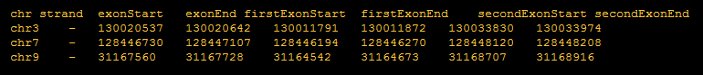

_[User input format for SE event]_

<table>
  <tr>
    <td width="34%">Exon coordinates are from three exons involved in skipping events.</td>
    <td></td>
  </tr>
</table>

Columns: `chr`, `strand`, `exonStart`, `exonEnd`, `firstExonStart`,
`firstExonEnd`, `secondExonStart`, `secondExonEnd`.

### MXE

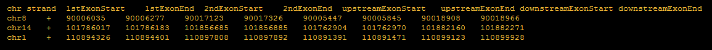

_[User input format for MXE event]_

<table>
  <tr>
    <td></td>
    <td width="34%">Exon coordinates are from four exons involved in mutually exclusive events.</td>
  </tr>
</table>

Columns: `chr`, `strand`, `1stExonStart`, `1stExonEnd`, `2ndExonStart`,
`2ndExonEnd`, `upstreamExonStart`, `upstreamExonEnd`,
`downstreamExonStart`, `downstreamExonEnd`.

### A5SS

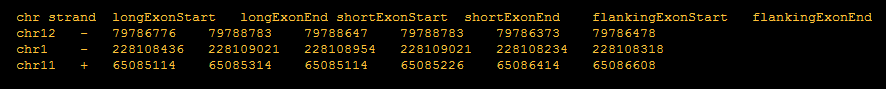

_[User input format for A5SS event]_

<table>
  <tr>
    <td width="34%">Exon coordinates are from three exons involved in alternative to 5' splicing events.</td>
    <td></td>
  </tr>
</table>

Columns: `chr`, `strand`, `longExonStart`, `longExonEnd`,
`shortExonStart`, `shortExonEnd`, `flankingExonStart`,
`flankingExonEnd`.

### A3SS

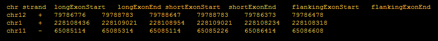

_[User input format for A3SS event]_

<table>
  <tr>
    <td></td>
    <td width="34%">Exon coordinates are from three exons involved in alternative to 3' splicing events.</td>
  </tr>
</table>

Columns: `chr`, `strand`, `longExonStart`, `longExonEnd`,
`shortExonStart`, `shortExonEnd`, `flankingExonStart`,
`flankingExonEnd`.

### RI

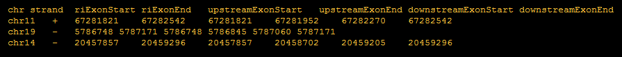

_[User input format for RI event]_

<table>
  <tr>
    <td width="34%">Exon coordinates are from three exons involved in retained intron events.</td>
    <td></td>
  </tr>
</table>

Columns: `chr`, `strand`, `riExonStart`, `riExonEnd`,
`upstreamExonStart`, `upstreamExonEnd`, `downstreamExonStart`,
`downstreamExonEnd`.

## Motif Map Workflow

1. Select a genome assembly and FASTA root.
2. Provide alternative splicing event sets using rMATS, MISO, or coordinate
   files.
3. Provide a known motif table and optionally a custom motif file.
4. Adjust optional parameters such as intron length, exon length, sliding window
   size, step size, p-value method, and significant-event thresholds.
5. Run the command and inspect the output folder.

Motif Map output typically includes RNA-map text files, p-value files, motif
enrichment summaries, logs, and PDF/PNG map visualizations when plotting
dependencies are available.

### Motif Map Output Examples

<table>
  <tr>
    <td>
      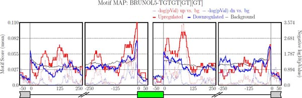 
      <em>[rMAPS Output example for SE event]</em>
    </td>
    <td>
      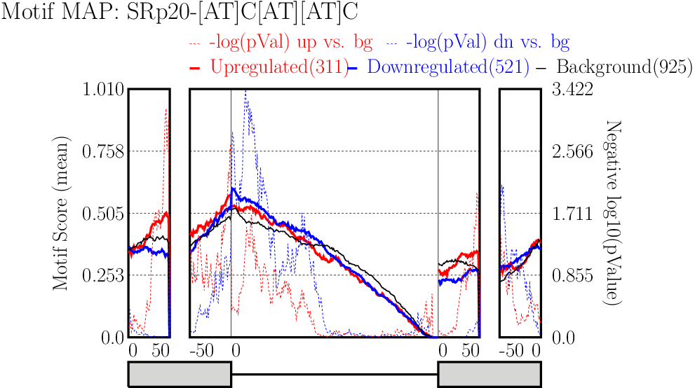 
      <em>[rMAPS Output example for RI event]</em>
    </td>
  </tr>
  <tr>
    <td>
      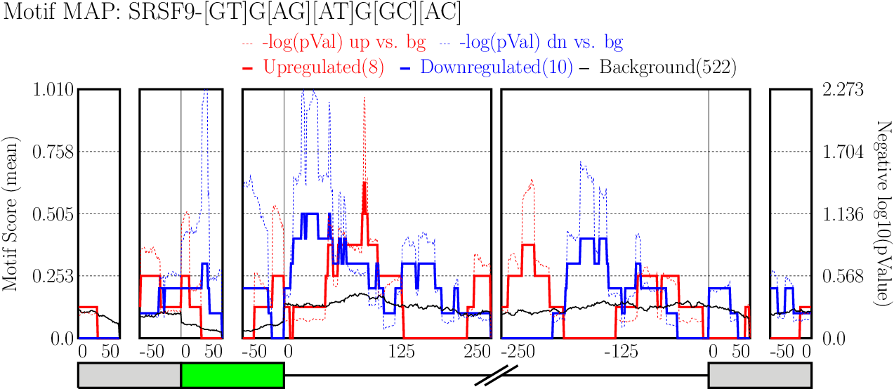 
      <em>[rMAPS Output example for A5SS event]</em>
    </td>
    <td>
      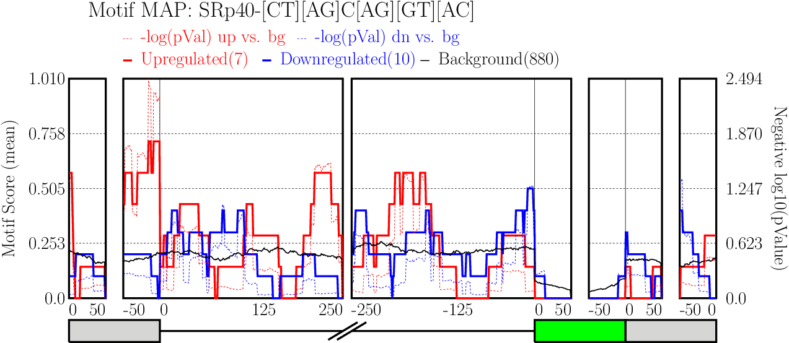 
      <em>[rMAPS Output example for A3SS event]</em>
    </td>
  </tr>
</table>

  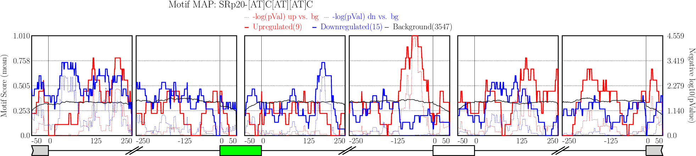 
  <em>[rMAPS Output example for MXE event]</em>

## CLIP Map Workflow

1. Provide alternative splicing event sets using rMATS, MISO, or coordinate
   files.
2. Provide a CLIP-seq peak file in BED-like format.
3. Set the RBP/protein label for the CLIP experiment.
4. Adjust optional parameters such as intron length, exon length, sliding window
   size, step size, p-value method, and significant-event thresholds.
5. Run the command and inspect the output folder.

CLIP Map output typically includes `*.RNAmap.txt` files, p-value files,
count-distribution files, logs, and PDF/PNG map visualizations when plotting
dependencies are available.

### CLIP Map Output Examples

<table>
  <tr>
    <td>
      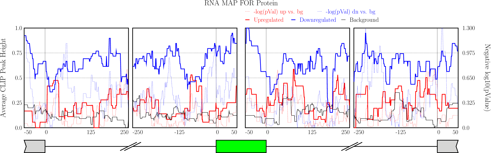 
      <em>[rMAPS Output example for SE event]</em>
    </td>
    <td>
      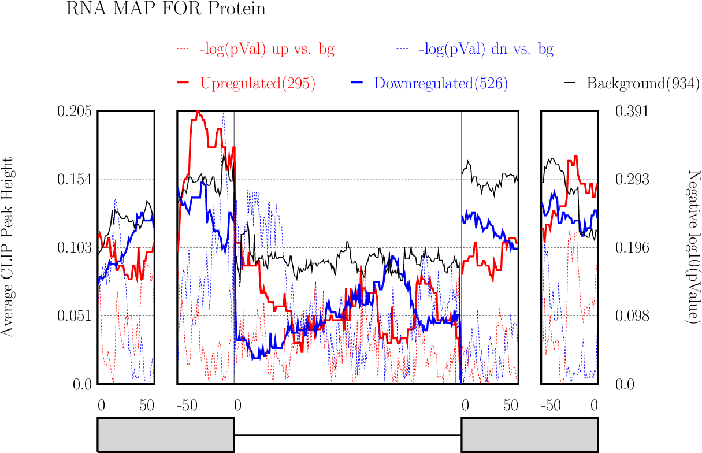 
      <em>[rMAPS Output example for RI event]</em>
    </td>
  </tr>
  <tr>
    <td>
      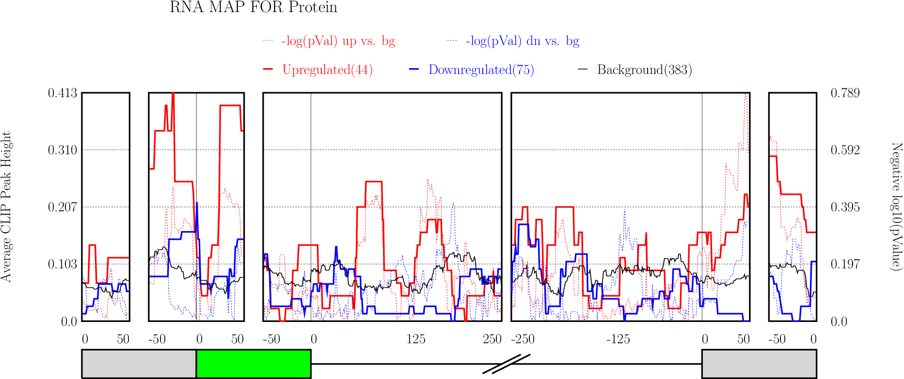 
      <em>[rMAPS Output example for A5SS event]</em>
    </td>
    <td>
      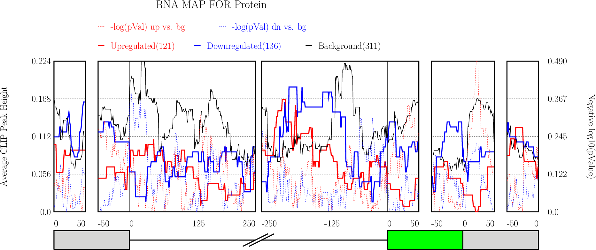 
      <em>[rMAPS Output example for A3SS event]</em>
    </td>
  </tr>
</table>

  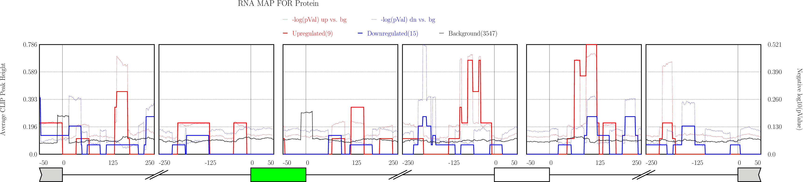 
  <em>[rMAPS Output example for MXE event]</em>

## Regular Expressions for Motifs

Custom motif inputs can use regular-expression style nucleotide patterns. For
example, `[TG]TGG[GC]T` matches four concrete sequences:

- `TTGGGT`
- `TTGGCT`
- `GTGGGT`
- `GTGGCT`

For the curated RBP motif table used by the original web tool, see
[RBP_MOTIFS.md](RBP_MOTIFS.md).
